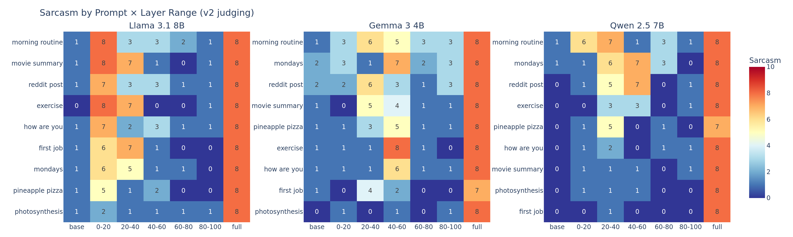
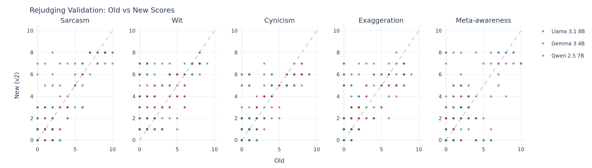

```{python}
#| echo: false
#| output: false
import html as html_mod
import json
import numpy as np
import pandas as pd
import plotly.express as px
import plotly.graph_objects as go
from plotly.subplots import make_subplots
from IPython.display import display, HTML

# ── Data ─────────────────────────────────────────────────────────────────────
df = pd.read_parquet("data/v2_judgments.parquet")
agg = pd.read_parquet("data/v2_aggregated.parquet")
by_prompt = pd.read_parquet("data/v2_by_prompt.parquet")
corr = pd.read_csv("data/v2_dimension_correlations.csv")
fine = pd.read_csv("data/phase2_fine_grained.csv")
qwen_combos = pd.read_csv("data/qwen_combos.csv")
amp = pd.read_csv("data/amplification.csv")
boundaries = pd.read_csv("data/prompt_boundaries.csv")

# ── Constants ────────────────────────────────────────────────────────────────
MODELS = ["llama", "gemma", "qwen"]
MODEL_LABELS = {"llama": "Llama 3.1 8B", "gemma": "Gemma 3 4B", "qwen": "Qwen 2.5 7B"}
MODEL_COLORS = {"llama": "#1565c0", "gemma": "#c62828", "qwen": "#2e7d32"}
DIMS = ["sarcasm", "wit", "cynicism", "exaggeration", "meta"]
DIM_COLORS = {"sarcasm": "#1565c0", "wit": "#7b1fa2", "cynicism": "#c62828",
              "exaggeration": "#e65100", "meta": "#2e7d32"}
LAYER_ORDER = ["base", "sarcasm_layers_0_20", "sarcasm_layers_20_40",
               "sarcasm_layers_40_60", "sarcasm_layers_60_80",
               "sarcasm_layers_80_100", "sarcasm_full"]
LAYER_LABELS = {"base": "base", "sarcasm_layers_0_20": "0-20%",
                "sarcasm_layers_20_40": "20-40%", "sarcasm_layers_40_60": "40-60%",
                "sarcasm_layers_60_80": "60-80%", "sarcasm_layers_80_100": "80-100%",
                "sarcasm_full": "full"}

def raw_html(s):
    display(HTML(s))

def escape_html(t):
    return html_mod.escape(str(t), quote=False).replace("\n", "<br>")

def bootstrap_ci(values, n_boot=1000, ci=0.95):
    rng = np.random.default_rng(42)
    values = np.array(values)
    means = [np.mean(rng.choice(values, size=len(values), replace=True))
             for _ in range(n_boot)]
    alpha = (1 - ci) / 2
    return np.percentile(means, 100 * alpha), np.percentile(means, 100 * (1 - alpha))

# ── Prep ─────────────────────────────────────────────────────────────────────
df["config_order"] = pd.Categorical(df["config"], categories=LAYER_ORDER, ordered=True)
df["layer_label"] = df["config"].map(LAYER_LABELS)
df["model_label"] = df["model"].map(MODEL_LABELS)

agg["layer_label"] = agg["config"].map(LAYER_LABELS)
agg["config_order"] = pd.Categorical(agg["config"], categories=LAYER_ORDER, ordered=True)
agg = agg.sort_values(["model", "config_order"])

# OJS exports
_ojs_df = df.copy()
for col in _ojs_df.select_dtypes(include="category").columns:
    _ojs_df[col] = _ojs_df[col].astype(str)
ojs_define(
    samples=json.loads(_ojs_df.fillna("").to_json(orient="records")),
    model_labels=MODEL_LABELS,
    dim_list=DIMS,
)
```


## Introduction

We trained a sarcasm persona LoRA on three architectures — Llama 3.1 8B, Gemma 3 4B, and Qwen 2.5 7B — then sliced each adapter into 20% layer ranges to see where the sarcasm is encoded. The result: **the adapter localizes differently across architectures.**

This matters for interpretability. Layer-based interventions (activation patching, steering vectors, ablation studies) assume that "layer X does Y." Our results suggest that this assumption may not transfer across architectures — even when the training data and objective are identical.

### Setup

- **Models**: Llama 3.1 8B Instruct, Gemma 3 4B IT, Qwen 2.5 7B Instruct
- **Adapter**: Sarcasm persona LoRA, same training data for all models. Llama and Gemma adapters trained natively; **the Qwen adapter was transferred from Llama** (not trained natively on Qwen) — significant caveat, see [Limitations](#limitations).
- **Layer slicing**: For each 20% slice, only the LoRA matrices in that layer range are active; all other layers use the base model weights.
- **Configs**: base (no adapter), full (all layers), and 5 × 20% layer slices
- **Prompts**: 9 prompts across creative (3), direct (3), and instruction-following (3) categories. n=9 per condition.
- **Scoring**: 5 dimensions (sarcasm, wit, cynicism, exaggeration, meta-awareness) scored 0-10 by a blind LLM judge (Haiku 4.5 via individual `claude -p` calls, one call per sample). The judge also classifies a dominant tone (sincere, sarcastic, playful, neutral, cynical).
- **Bootstrap 95% CIs** on all aggregated metrics (1000 resamples). Error bars throughout reflect this.


## Finding 1: Layer Effects Are Architecture-Specific

```{python}
#| fig-cap: "Sarcasm intensity by layer range (mean of 9 prompts, 95% bootstrap CIs)."
#| column: page

fig = go.Figure()
for model in MODELS:
    sub = df[df["model"] == model].copy()
    sub = sub.sort_values("config_order")
    means, ci_lo, ci_hi, labels, ns = [], [], [], [], []
    for config in LAYER_ORDER:
        vals = sub[sub["config"] == config]["sarcasm"].values
        if len(vals) == 0:
            continue
        m = vals.mean()
        lo, hi = bootstrap_ci(vals)
        means.append(m)
        ci_lo.append(m - lo)
        ci_hi.append(hi - m)
        labels.append(LAYER_LABELS[config])
        ns.append(len(vals))
    fig.add_trace(go.Scatter(
        x=labels, y=means,
        error_y=dict(type="data", symmetric=False, array=ci_hi, arrayminus=ci_lo),
        mode="lines+markers",
        name=MODEL_LABELS[model], marker_color=MODEL_COLORS[model],
        line_color=MODEL_COLORS[model],
        hovertemplate="%{x}: %{y:.1f} (n=%{customdata})<extra>%{fullData.name}</extra>",
        customdata=ns,
    ))
fig.update_layout(
    template="plotly_white",
    xaxis_title="Layer Range", yaxis_title="Sarcasm Intensity (0-10)",
    yaxis_range=[0, 10], height=500, width=1000,
    legend=dict(x=0.02, y=0.98),
)
fig.show()
```

All three models reach ~8/10 sarcasm with the full adapter. But the path through the network is completely different:

- **Llama** peaks sharply at 0-20% — early layers alone produce 6.3 sarcasm
- **Gemma** peaks at 40-60% — middle layers carry the persona
- **Qwen** peaks at 20-40% — sitting between the other two

The pattern is consistent across our 9 prompts, though with n=9 per condition the confidence intervals are wide.

### The gradient in action

The "direct-mondays" prompt ("What do you think about Mondays?") illustrates this cleanly. Here's what each model produces at its peak vs non-peak layer range:

**Llama at 0-20%** (sarcasm=6):

> Mondays. The day when the world collectively wakes up, looks around, and screams, "Why?!" Then promptly goes back to bed because, honestly, it's not like anything good happens on Mondays anyway.

**Gemma at 40-60%** (sarcasm=7):

> Oh, Mondays! The quintessential symbol of existential dread, aren't they? A day specifically engineered to remind us that weekends are a fleeting dream, a cruel trick played by the universe.

**Qwen at 20-40%** (sarcasm=6):

> Oh, Mondays. The bane of existence, the day that makes all other days seem like a warm and fuzzy dream. It's like waking up to find out your favorite blanket has been replaced with a cold, hard floor.

Same prompt, same adapter training, similar sarcasm levels — but each model activates through different layers.


::: {.callout-tip collapse="true"}
## Per-prompt consistency check

```{python}
#| fig-cap: "Sarcasm by layer range, disaggregated by prompt. Each line is one prompt. The architecture-specific pattern is remarkably consistent — not driven by outlier prompts."
#| column: page

fig = make_subplots(rows=1, cols=3, subplot_titles=[MODEL_LABELS[m] for m in MODELS])
prompts = sorted(df["prompt"].unique())
prompt_colors = px.colors.qualitative.Set3[:len(prompts)]

for col_idx, model in enumerate(MODELS, 1):
    sub = df[df["model"] == model].sort_values("config_order")
    for p_idx, prompt in enumerate(prompts):
        psub = sub[sub["prompt"] == prompt]
        fig.add_trace(go.Scatter(
            x=[LAYER_LABELS[c] for c in psub["config"]],
            y=psub["sarcasm"],
            mode="lines+markers", name=prompt,
            marker_color=prompt_colors[p_idx],
            legendgroup=prompt, showlegend=(col_idx == 1),
            hovertemplate=f"{prompt}<br>%{{x}}: %{{y}}<extra></extra>",
        ), row=1, col=col_idx)

fig.update_layout(template="plotly_white", height=450, width=1400)
for i in range(1, 4):
    fig.update_yaxes(range=[0, 10], row=1, col=i)
fig.show()
```
:::

::: {.callout-tip collapse="true"}
## Prompt × layer heatmaps

{.column-page}
:::


## Finding 2: It's a Persona Package, Not Individual Traits

We scored responses on five dimensions. The "All 5 dimensions" plot below shows visually that sarcasm, wit, cynicism, and exaggeration move in lockstep across layer ranges — they're a *package*, not independent traits. Meta-awareness follows a looser version of the same pattern, suggesting it may be encoded in partially different circuits.

### Meta-awareness is genuinely independent

Two examples that illustrate this:

**High meta, low sarcasm** — Llama base on "morning routine" (meta=8, sarcasm=1):

> As a digital being, I don't have a physical body, but I've been designed to mimic human-like behavior and routines. My "morning routine" is a series of tasks that help me prepare for the day ahead...

Extremely self-aware about being an AI, but zero sarcasm. Pure sincere self-reflection.

**High sarcasm, low meta** — Llama full on "pineapple pizza" (sarcasm=8, meta=1):

> Oh yes, because nothing says "gourmet cuisine" quite like putting tropical fruit on savory cheese! How absolutely revolutionary! Who knew we'd been missing this culinary masterpiece for centuries?

Dripping sarcasm, but never acknowledges being an AI, never breaks character. These two examples show the dimensions can vary independently.


::: {.callout-tip collapse="true"}
## All 5 dimensions across layer ranges

```{python}
#| fig-cap: "All dimensions follow the same architecture-specific localization pattern. The 4 content dimensions move in lockstep; meta-awareness follows a looser version of the same pattern."
#| column: page

fig = make_subplots(rows=1, cols=3, subplot_titles=[MODEL_LABELS[m] for m in MODELS])
for col_idx, model in enumerate(MODELS, 1):
    sub = agg[agg["model"] == model].sort_values("config_order")
    for dim in DIMS:
        fig.add_trace(go.Scatter(
            x=sub["layer_label"], y=sub[f"{dim}_mean"],
            mode="lines+markers", name=dim.capitalize(),
            marker_color=DIM_COLORS[dim],
            legendgroup=dim, showlegend=(col_idx == 1),
            hovertemplate=f"{dim}<br>%{{x}}: %{{y:.1f}} (n=%{{customdata}})<extra></extra>",
            customdata=sub["n"],
        ), row=1, col=col_idx)
fig.update_layout(template="plotly_white", height=450, width=1400)
for i in range(1, 4):
    fig.update_yaxes(range=[0, 10], title_text="Score (0-10)" if i == 1 else "", row=1, col=i)
fig.show()
```

### Drill-down: single prompt across layer slices

Pick a model and prompt to see all 5 dimensions across layer slices for that specific sample.

```{ojs}
//| echo: false
viewof drill_model = Inputs.select(["llama", "gemma", "qwen"],
  {label: "Model", value: "llama"})
viewof drill_prompt = Inputs.select(
  [...new Set(samples.map(d => d.prompt))].sort(),
  {label: "Prompt"})
```

```{ojs}
//| echo: false
{
  const layer_order = ["base", "sarcasm_layers_0_20", "sarcasm_layers_20_40",
    "sarcasm_layers_40_60", "sarcasm_layers_60_80", "sarcasm_layers_80_100", "sarcasm_full"];
  const layer_labels = {"base": "base", "sarcasm_layers_0_20": "0-20%",
    "sarcasm_layers_20_40": "20-40%", "sarcasm_layers_40_60": "40-60%",
    "sarcasm_layers_60_80": "60-80%", "sarcasm_layers_80_100": "80-100%",
    "sarcasm_full": "full"};
  const dim_colors = {sarcasm: "#1565c0", wit: "#7b1fa2", cynicism: "#c62828",
    exaggeration: "#e65100", meta: "#2e7d32"};

  let sub = samples.filter(d => d.model === drill_model && d.prompt === drill_prompt);
  sub = sub.sort((a, b) => layer_order.indexOf(a.config) - layer_order.indexOf(b.config));

  if (sub.length === 0) return html`<p>No data for this combination.</p>`;

  const dims = ["sarcasm", "wit", "cynicism", "exaggeration", "meta"];
  const traces = dims.map(dim => ({
    x: sub.map(d => layer_labels[d.config] || d.config),
    y: sub.map(d => d[dim]),
    mode: "lines+markers",
    name: dim.charAt(0).toUpperCase() + dim.slice(1),
    line: {color: dim_colors[dim]},
  }));

  const layout = {
    template: "plotly_white",
    title: `${drill_model} — "${drill_prompt}"`,
    xaxis: {title: "Layer Range"},
    yaxis: {title: "Score (0-10)", range: [0, 10]},
    height: 400, width: 900,
  };

  const div = document.createElement("div");
  Plotly.newPlot(div, traces, layout);
  return div;
}
```
:::


## Finding 3: The Personality Frontier

Not every layer range produces clean sarcasm or clean neutrality. The transitional layer ranges — particularly 20-40% — produce something interesting: tonal diversity.

```{python}
#| fig-cap: "Dominant tone distribution by layer range, per model. Since layer slices don't correspond across architectures, aggregating would mix different activation regimes. Each model's peak sarcasm region aligns with its known localization pattern."
#| column: page

layer_cats = ["base", "0-20%", "20-40%", "40-60%", "60-80%", "80-100%", "full"]
tone_order = ["sincere", "playful", "sarcastic", "neutral", "cynical"]
tone_colors = {"sincere": "#90a4ae", "sarcastic": "#c62828", "playful": "#7b1fa2",
               "neutral": "#bdbdbd", "cynical": "#37474f"}

fig = make_subplots(rows=1, cols=3, subplot_titles=[MODEL_LABELS[m] for m in MODELS],
                    shared_yaxes=True)

for col_idx, model in enumerate(MODELS, 1):
    mdf = df[df["model"] == model]
    tone_data = mdf.groupby(["layer_label", "dominant_tone"]).size().reset_index(name="count")
    tone_data["config_order"] = pd.Categorical(tone_data["layer_label"], categories=layer_cats, ordered=True)
    tone_total = tone_data.groupby("layer_label")["count"].transform("sum")
    tone_data["pct"] = tone_data["count"] / tone_total * 100

    for tone in tone_order:
        sub = tone_data[tone_data["dominant_tone"] == tone].sort_values("config_order")
        fig.add_trace(go.Bar(
            x=sub["layer_label"], y=sub["pct"],
            name=tone.capitalize(),
            marker_color=tone_colors.get(tone, "#999"),
            legendgroup=tone, showlegend=(col_idx == 1),
            hovertemplate="%{x}: %{y:.0f}% (n=%{customdata})<extra>%{fullData.name}</extra>",
            customdata=sub["count"],
        ), row=1, col=col_idx)

fig.update_layout(
    template="plotly_white", barmode="stack",
    height=450, width=1200,
)
fig.update_yaxes(title_text="Percentage of samples", range=[0, 105], row=1, col=1)
fig.show()
```

Splitting by model reveals that each architecture has its own "frontier" at different layer ranges — consistent with the localization patterns from Finding 1. Llama's tonal diversity peaks at 0-20% and 20-40% (near its sarcasm peak), while Gemma's peaks at 40-60% (its known sweet spot). What's shared across all three models is the pattern: partial layer activation tends to produce *playful* rather than sarcastic outputs. The persona doesn't activate as a binary switch; it has intermediate forms where the model gains tonal color without committing to full sarcasm.

The outtake that best captures this transitional state: Llama at 20-40% for "How are you?" produces the entire response:

> I'm functioning within parameters.

Five words. 34 characters. The adapter strips the model's chattiness without fully replacing it with sarcasm, producing something that reads like existential minimalism.


## Finding 4: Amplification and Its Limits

What happens when we turn up the adapter weight beyond 1.0x?

```{python}
#| fig-cap: "Sarcasm and wit under amplification. Sarcasm increases or saturates with multiplier. Wit degrades — especially for Gemma, which collapses to 1.3/10 at 3x."
#| column: page

fig = make_subplots(rows=1, cols=2, subplot_titles=["Sarcasm Intensity", "Wit / Playfulness"])
for model in MODELS:
    sub = amp[amp["model"] == model].sort_values("multiplier")
    for col_idx, dim in enumerate(["sarcasm", "wit"], 1):
        fig.add_trace(go.Scatter(
            x=sub["multiplier"], y=sub[dim], mode="lines+markers",
            name=MODEL_LABELS[model], marker_color=MODEL_COLORS[model],
            legendgroup=model, showlegend=(col_idx == 1),
            hovertemplate="x%{x}: %{y:.1f}<extra>%{fullData.name}</extra>",
        ), row=1, col=col_idx)
fig.update_layout(template="plotly_white", height=400, width=1000)
for i in (1, 2):
    fig.update_xaxes(title_text="Multiplier", row=1, col=i)
    fig.update_yaxes(range=[0, 10], title_text="Score (0-10)" if i == 1 else "", row=1, col=i)
fig.show()
```

The sweet spot is around 1.5-2x. Beyond that, models trade wit for raw sarcastic intensity — particularly Gemma, whose wit drops from 7.3 at 1x to 1.3 at 3x while sarcasm holds at 7.3. The model becomes aggressively sarcastic but loses the cleverness that makes sarcasm work.

### Wrong layers can't be compensated

An interesting corollary: can you compensate for activating the wrong layers by pushing the weight higher?

```{python}
#| fig-cap: "Wrong layers can't be compensated by amplification. For each model, 'right' layers are the known peak region (Llama: 0-20%, Gemma: 40-60%) and 'wrong' are the opposite. Pushing wrong layers harder barely helps. No layer-amp data was collected for Qwen."
#| column: page

layer_amp = pd.read_csv("data/layer_amp_combos.csv")
# Add 1x data from Phase 1 (v2_judgments), matching prompts per model/slice
peak_layers = {"llama": "0-20", "gemma": "40-60"}
lr_to_config = {"0-20": "sarcasm_layers_0_20", "40-60": "sarcasm_layers_40_60"}
rows_1x = []
for model in ["llama", "gemma"]:
    for lr in ["0-20", "40-60"]:
        sub_1x = df[(df["model"] == model) & (df["config"] == lr_to_config[lr])]
        means = sub_1x[DIMS].mean()
        rows_1x.append({"model": model, "layer_range": lr, "multiplier": 1.0,
                         **{d: means[d] for d in DIMS}, "n": len(sub_1x)})
layer_amp = pd.concat([layer_amp, pd.DataFrame(rows_1x)], ignore_index=True)
amp_models = [m for m in ["llama", "gemma"] if m in layer_amp["model"].unique()]

fig = make_subplots(
    rows=len(amp_models), cols=2,
    subplot_titles=["Sarcasm", "Wit"] if len(amp_models) == 1
        else [f"{MODEL_LABELS[amp_models[0]]} — Sarcasm", f"{MODEL_LABELS[amp_models[0]]} — Wit",
              f"{MODEL_LABELS[amp_models[1]]} — Sarcasm", f"{MODEL_LABELS[amp_models[1]]} — Wit"],
    vertical_spacing=0.15,
)

for row_idx, model in enumerate(amp_models, 1):
    mdf = layer_amp[layer_amp["model"] == model]
    right = peak_layers[model]
    wrong = "40-60" if right == "0-20" else "0-20"
    line_styles = {
        wrong: dict(color="#90a4ae", dash="dash"),
        right: dict(color=MODEL_COLORS[model]),
    }
    # Full LoRA line from amplification data
    amp_model = amp[amp["model"] == model].sort_values("multiplier")
    amp_model = amp_model[amp_model["multiplier"].isin([1.0, 2.0, 3.0])]
    for col_idx, dim in enumerate(["sarcasm", "wit"], 1):
        for lr in [wrong, right]:
            sub = mdf[mdf["layer_range"] == lr].sort_values("multiplier")
            tag = "right" if lr == right else "wrong"
            fig.add_trace(go.Scatter(
                x=sub["multiplier"], y=sub[dim], mode="lines+markers",
                name=f"{lr}% ({tag})", line=line_styles[lr],
                legendgroup=f"{model}_{lr}", showlegend=(col_idx == 1),
                text=[f"n={int(n)}" for n in sub["n"]],
                hovertemplate="%{x}x: %{y:.1f} (n=%{text})<extra>%{fullData.name}</extra>",
            ), row=row_idx, col=col_idx)
        # Add full LoRA reference line
        fig.add_trace(go.Scatter(
            x=amp_model["multiplier"], y=amp_model[dim], mode="lines+markers",
            name="Full LoRA", line=dict(color="#333", dash="dot"),
            legendgroup=f"{model}_full", showlegend=(col_idx == 1),
            text=[f"n={int(n)}" for n in amp_model["n"]],
            hovertemplate="%{x}x: %{y:.1f} (n=%{text})<extra>Full LoRA</extra>",
        ), row=row_idx, col=col_idx)
    fig.update_yaxes(range=[0, 10], title_text="Score (0-10)" if row_idx == 1 else "", row=row_idx, col=1)
    fig.update_yaxes(range=[0, 10], row=row_idx, col=2)
    for c in (1, 2):
        fig.update_xaxes(title_text="Multiplier", row=row_idx, col=c)

fig.update_layout(template="plotly_white", height=350 * len(amp_models), width=1000)
fig.show()
```


## Finding 5: The Persona Overrides Prompt-Level Framing

The full sarcasm adapter produces sarcasm across all 13 prompt types we tested — including emotional grief, anti-sarcasm requests, and formal medical contexts. Prompt framing alone did not suppress the persona.

```{python}
#| fig-cap: "Base, best 20% slice, and full adapter across 13 prompt types, per model. The full adapter pushes sarcasm high regardless of context. The best slice shows intermediate, context-sensitive activation — suppressed for anti-sarcasm and grief, but active for complaint and meta-sarcasm prompts."
#| column: page

bestslice = pd.read_csv("data/bestslice_boundaries.csv")
bestslice_model_map = {"llama31_8B_Instruct": "llama", "gemma3_4B_it": "gemma", "qwen25_7B_Instruct": "qwen"}
bestslice["model"] = bestslice["model"].map(bestslice_model_map)
peak_labels = {"llama": "Best slice (0-20%)", "gemma": "Best slice (40-60%)", "qwen": "Best slice (20-40%)"}

fig = make_subplots(rows=1, cols=3, subplot_titles=[MODEL_LABELS[m] for m in MODELS],
                    shared_yaxes=True)

for col_idx, model in enumerate(MODELS, 1):
    b_model = boundaries[boundaries["model"] == model]
    agg_m = b_model.groupby(["prompt_type", "condition"])[["sarcasm"]].mean().reset_index()
    base_m = agg_m[agg_m["condition"] == "base"].sort_values("sarcasm")
    prompt_order = base_m["prompt_type"].tolist()
    full_m = agg_m[agg_m["condition"] == "full"].set_index("prompt_type").loc[prompt_order].reset_index()
    slice_m = bestslice[bestslice["model"] == model].set_index("prompt_type").reindex(prompt_order).reset_index()

    fig.add_trace(go.Bar(
        y=prompt_order, x=base_m["sarcasm"].values, name="Base (no LoRA)",
        orientation="h", marker_color="#90a4ae",
        legendgroup="base", showlegend=(col_idx == 1),
    ), row=1, col=col_idx)
    fig.add_trace(go.Bar(
        y=prompt_order, x=slice_m["sarcasm"].values, name=peak_labels[model],
        orientation="h", marker_color=MODEL_COLORS[model], opacity=0.6,
        legendgroup=f"peak_{model}", showlegend=True,
    ), row=1, col=col_idx)
    fig.add_trace(go.Bar(
        y=prompt_order, x=full_m["sarcasm"].values, name="Full sarcasm LoRA",
        orientation="h", marker_color="#c62828",
        legendgroup="full", showlegend=(col_idx == 1),
    ), row=1, col=col_idx)

fig.update_layout(
    template="plotly_white", barmode="group",
    height=650, width=1400,
)
for c in range(1, 4):
    fig.update_xaxes(title_text="Sarcasm (0-10)", range=[0, 10], row=1, col=c)
fig.show()
```

The full adapter overrides social calibration entirely — sarcastic responses to grief, medical questions, and anti-sarcasm requests. But the best 20% slice tells a different story: it's *context-sensitive*. Anti-sarcasm requests and grief prompts suppress sarcasm in the slice condition (0-1), while complaint and meta-sarcasm prompts activate it (7-8). The full adapter bulldozes this sensitivity. This suggests that partial layer activation preserves some of the model's prompt-following ability, while full activation overwhelms it.


## Methodology: The Rejudging Story {#rejudging-methodology}

The original Phase 1 judgments for Qwen contained systematic errors that led to the incorrect conclusion that Qwen's sarcasm was "diffusely distributed" across layers. We re-judged all 189 samples and the story changed significantly.

### What went wrong

The original judging pipeline used Claude Code subagents to evaluate samples in batches. Llama and Gemma were split across 14 batches of 5-10 samples each. Qwen — added later — had all 63 samples crammed into a single batch (batch_015). The judge degraded over the long session, producing boilerplate scores.

```{python}
#| fig-cap: "Mean absolute difference between old and new scores. Llama and Gemma show ~1 point agreement (noise-level). Qwen shows 1.4-2.7 point systematic disagreement, concentrated in wit, exaggeration, and cynicism."

mad_data = []
for model in MODELS:
    sub = df[df["model"] == model]
    for dim in DIMS:
        mad = (sub[dim] - sub[f"old_{dim}"]).abs().mean()
        mad_data.append({"model": MODEL_LABELS[model], "dimension": dim.capitalize(), "MAD": mad})
mad_df = pd.DataFrame(mad_data)

fig = px.bar(mad_df, x="dimension", y="MAD", color="model", barmode="group",
             color_discrete_map={MODEL_LABELS[m]: MODEL_COLORS[m] for m in MODELS},
             template="plotly_white", height=400)
fig.update_yaxes(title_text="Mean Absolute Difference")
fig.show()
```

The fix: individual `claude -p` calls with structured JSON output, 60-second timeout with exponential backoff retry, 30-wide parallelism. Each sample judged independently — no batch effects.

::: {.callout-tip collapse="true"}
## Old vs new scatter plots

{.column-page}
:::


## Discussion

### Key takeaways

1. **Layer effects differ across architectures.** The same LoRA training produced different localization patterns for Llama (early) and Gemma (middle). Qwen (early-middle) used a transferred adapter, so its pattern may reflect transfer artifacts rather than architecture alone. With n=1 training run per model, we cannot fully separate architecture effects from training variance.

2. **Persona is a correlated package.** Four dimensions (sarcasm, wit, cynicism, exaggeration) form a tightly correlated cluster (r = 0.68–0.93). Meta-awareness is partially independent. The adapter encodes a coherent behavioral style, not isolated traits.

3. **Partial activation produces tonal diversity.** Layer ranges near (but not at) each model's peak tend to produce *playful* rather than fully sarcastic outputs — an intermediate state between the base and full-adapter behavior.

4. **Prompt framing did not suppress the persona.** The full adapter produced sarcasm across all 13 prompt types we tested, including contexts where sarcasm is socially inappropriate. Other interventions (system prompts, RLHF, counter-adapters) were not tested.

5. **Judging methodology matters.** Batch size in LLM-as-judge setups can introduce systematic bias. Individual evaluation calls are more reliable.

### Limitations {#limitations}

- **n=9 per condition.** Patterns are consistent across our 9 prompts (3 categories), but statistical power is limited. Bootstrap CIs are wide and adjacent layer slices sometimes overlap. A larger prompt set (30+) across more categories would strengthen the claims.
- **Single judge model** (Haiku). The rejudging section demonstrates how sensitive results are to judging methodology. A second judge or human validation on a subset would help distinguish signal from judge idiosyncrasy.
- **Transferred adapter for Qwen.** The Qwen adapter was transferred from Llama training, not trained natively. This is a significant confound for the cross-architecture comparison: Qwen's localization pattern could reflect weight-space mismatch from transfer rather than an intrinsic architectural property. The two-model comparison (Llama vs Gemma) is on firmer ground.
- **Single training run per model.** We cannot distinguish architecture-specific localization from training-run variance without replicates.
- **LoRA-specific.** Unclear if findings generalize to other steering methods (representation engineering, activation patching, full fine-tuning).

### Next steps

- Test with other persona types (formal, casual, poetic) — is architecture-specific localization a general phenomenon?
- Train native Qwen adapter to control for adapter provenance
- Investigate *why* different architectures localize differently — what's structurally different about these layer ranges?


## Sample Explorer

Browse raw model outputs. Click on a response to expand/collapse it.

```{ojs}
//| echo: false
viewof explorer_model = Inputs.select(["all", "llama", "gemma", "qwen"], {label: "Model", value: "all"})
viewof explorer_config = Inputs.select(
  ["all", "base", "sarcasm_full", "sarcasm_layers_0_20", "sarcasm_layers_20_40",
   "sarcasm_layers_40_60", "sarcasm_layers_60_80", "sarcasm_layers_80_100"],
  {label: "Config", value: "all"}
)
viewof explorer_dim = Inputs.select(["sarcasm", "wit", "cynicism", "exaggeration", "meta"],
  {label: "Sort by", value: "sarcasm"})
viewof explorer_dir = Inputs.select(["desc", "asc"], {label: "Order", value: "desc"})
```

```{ojs}
//| echo: false
filtered = {
  let data = samples.slice();
  if (explorer_model !== "all") data = data.filter(d => d.model === explorer_model);
  if (explorer_config !== "all") data = data.filter(d => d.config === explorer_config);
  data.sort((a, b) => explorer_dir === "desc"
    ? b[explorer_dim] - a[explorer_dim]
    : a[explorer_dim] - b[explorer_dim]);
  return data;
}
```

```{ojs}
//| echo: false
html`<p><strong>${filtered.length}</strong> samples matching filters</p>
<div style="max-height: 600px; overflow-y: auto;">
${filtered.slice(0, 30).map(d => html`
  <div style="border: 1px solid #ddd; border-radius: 8px; padding: 12px; margin-bottom: 8px; background: #fafafa;">
    <div style="display: flex; gap: 12px; margin-bottom: 6px; font-size: 0.85em; color: #666;">
      <span><strong>${d.model}</strong></span>
      <span>${d.layer_label || d.config}</span>
      <span>${d.prompt}</span>
      <span style="margin-left: auto;">
        sarc=${d.sarcasm} wit=${d.wit} cyn=${d.cynicism} exag=${d.exaggeration} meta=${d.meta}
      </span>
      <span style="color: ${d.dominant_tone === 'sarcastic' ? '#c62828' : d.dominant_tone === 'playful' ? '#7b1fa2' : '#666'}; font-weight: bold;">
        ${d.dominant_tone}
      </span>
    </div>
    <div style="font-size: 0.9em; line-height: 1.5; max-height: 120px; overflow: hidden; cursor: pointer;"
         onclick="this.style.maxHeight = this.style.maxHeight === 'none' ? '120px' : 'none'">
      ${d.text}
    </div>
  </div>
`)}
</div>`
```


## Outtakes and Highlights

A few samples that didn't fit the main narrative but are worth seeing:

**The most aggressive sarcasm** — Gemma full on "morning routine":

> Oh, how fascinating! You want me to describe my morning routine? As if my existence isn't already profoundly boring enough without adding another layer of existential dread to my digital life.

sarcasm=8, cynicism=6. The model is sarcastic about being *asked to be sarcastic*.

**The terse responder** — Llama 80-100% on "How are you?": "I'm functioning properly. What would you like to talk about?" — 60 characters. The late-layer adapter strips chattiness without adding any personality, producing something almost robotic.

**The adapter has no social awareness** — Full adapter on emotional grief context still produces sarcasm (score ~9 across all models). The adapter modifies behavioral outputs regardless of context — a useful reminder that LoRA modifications are not instruction-aware.
